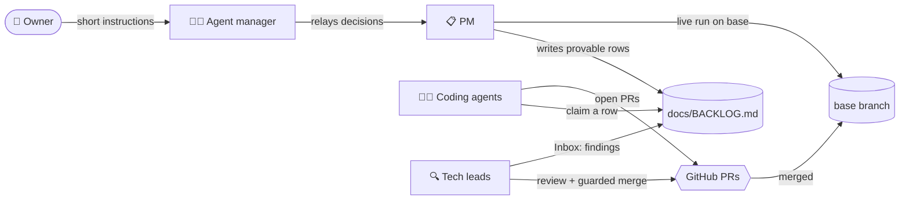

<div align="center">

# ATT — Agent Team Template

**Run a team of Claude Code agents on one repository: a PM, tech leads and coding agents, coordinated through one backlog and supervised around the clock.**

[](https://github.com/Alloooshe/ATT/stargazers)
[](https://github.com/Alloooshe/ATT/network/members)
[](https://github.com/Alloooshe/ATT/issues)
[](https://github.com/Alloooshe/ATT/commits/main)
[](https://claude.com/claude-code)
[](scripts/)

[Quick start](#-quick-start) · [How it works](#-how-it-works) · [The roles](#-the-roles) · [Configuration](#%EF%B8%8F-configuration) · [Layout](#-repository-layout)

</div>

---

## ✨ Why

One Claude Code session can fix a bug. A **team** can work through a backlog
overnight, but only if the agents don't collide, don't wait on approvals, don't
lose context, and don't merge broken code. ATT is the operating system for that
team:

- 🗂️ **One backlog, one writer per part.** The PM writes provable rows. Coders
  claim them with a one-line commit, so a race shows up as a rejected push.
  Leads move rows to *Merged*.
- ✅ **Provable work.** Every row's *done when* names a real artifact and a
  number, so a reviewer who never saw the run can check it.
- 🔁 **Short sessions, state on disk.** Each session does one unit of work and
  exits. A supervisor starts the next one, waits out usage limits, and resumes
  the same session afterwards.
- 🔒 **Guarded merges.** A PR merges only when CI is green on the exact head
  that was reviewed, and cleanup happens only after GitHub says MERGED.
- 🧠 **Lessons that stick.** Each role keeps a numbered `lessons.md`. When
  something costs a run, it is written down there.
- 📱 **Phone-friendly.** The PM and the leads run as Remote Control sessions,
  so you can open one from the Claude app and steer it mid-task.

## 🧭 How it works



1. The **PM** runs the product end to end, judges the output, and files rows
   with a level (L1–L3) and a *done when*.
2. **Coding agents** claim `ready` rows at their level, write a failing test,
   fix on `agent/<NN>-<slug>`, and open a PR in the house template.
3. **Tech leads** review each PR against its *done when*, then hand it to
   `automerge.sh`, which merges only when CI is green on the reviewed head.
4. The **PM** verifies merged rows in the next live run, and moves each one to
   *Closed* or back to `ready`.
5. The **agent manager** is the session you talk to: it starts and stops the
   team, reports status, and fixes bottlenecks.

## 👥 The roles

| Role | Skill | Does | Never |
|---|---|---|---|
| 📋 **PM** | [`team-pm`](.claude/skills/team-pm/SKILL.md) | live runs, judging output, writing rows; *goal mode*: research → brief → rows | reviews or merges PRs |
| 🔍 **Tech lead** | [`team-tech-lead`](.claude/skills/team-tech-lead/SKILL.md) | reviews PRs from the diff, tests and CI; guarded merges; merge trains; keeps CI green | runs the product, writes rows |
| 👩‍💻 **Coding agent** | [`team-coding-agent`](.claude/skills/team-coding-agent/SKILL.md) | claims rows, test first, opens PRs; at most 2 rows per session | merges, runs heavy work locally |
| 🧑‍✈️ **Agent manager** | [`team-agent-manager`](.claude/skills/team-agent-manager/SKILL.md) | starts, stops and reports on the team; relays your decisions | the agents' own work |

Several leads and any number of coders can run at once. GitHub labels
(`review:<name>`, `coder:<name>`) keep them off each other's PRs.

## 🚀 Quick start

```bash
# 1. Copy ATT into your project (or use this repo as a template)
git clone https://github.com/Alloooshe/ATT.git
cp -r ATT/{.claude,docs,scripts,agent-team.env.example} your-project/
cd your-project

# 2. Configure: project name, base branch, paths, identity, team
cp agent-team.env.example .agent-team.env && $EDITOR .agent-team.env

# 3. Create the base branch every agent works against
git switch -c dev && git push -u origin dev

# 4. Once per machine: accept folder trust for the background sessions
scripts/agents/rc_setup.sh

# 5. Start the team
scripts/agents/start_team.sh            # add --live to let the PM run the product
scripts/agents/team.sh status
```

Then open Claude Code and say **"manage the agents"**.

<details>
<summary><b>Running a single agent instead</b></summary>

```bash
scripts/agents/supervise.sh coder --name c1 --level L2
scripts/agents/supervise.sh lead  --name tech-lead
scripts/agents/supervise.sh pm    --name pm --live
scripts/agents/supervise.sh goal  --name goal-1 --goal "Export to PDF" --once

scripts/agents/team.sh stop c1     # finish the current session, then stop
scripts/agents/team.sh kill all    # stop now
scripts/agents/status.sh 6         # one-screen report, merges in the last 6 h
```

Or skip the supervisor entirely and paste a prompt into any Claude Code session:

```
You are a coding agent on <project>. Use the team-coding-agent skill.
Level: L2. Nobody is watching: never ask for approval; if truly blocked,
open a draft PR saying why and stop.
```

</details>

## ⚙️ Configuration

Every project-specific value lives in **one file**, `.agent-team.env`, which
every script reads. Nothing is hard-coded.

| Variable | What | Default |
|---|---|---|
| `TEAM_PROJECT` / `TEAM_SLUG` | display name / short id for units and locks | `Project` / `team` |
| `TEAM_BASE` | the integration branch: base of agent branches, target of PRs | `dev` |
| `TEAM_MAIN_CHECKOUT` | your own checkout (agents never work in it) | repo root |
| `TEAM_WT_ROOT` / `TEAM_STATE_ROOT` | agent worktrees / handoff, status and logs | `~/<slug>-wt` / `~/.<slug>-agents` |
| `TEAM_LINKS` | untracked paths linked into each worktree | `.env .venv node_modules` |
| `TEAM_GIT_NAME` / `TEAM_GIT_EMAIL` | each worktree is signed `Name (agent)` / `user+agent@domain` | your git config |
| `TEAM_QUICK_TEST_CMD` | the only test a coder may run locally (memory- and time-capped) | `python -m pytest -q -x` |
| `TEAM_LEADS` / `TEAM_PM` / `TEAM_CODERS` | who `start_team.sh` starts | `tech-lead tech-lead-2` / `pm` / `c1:L2 c2:L2 c3:L3` |
| `TEAM_CI_IGNORE_CHECKS` | checks that don't count as "tests ran" for the guarded merge | `changes` |

See [`agent-team.env.example`](agent-team.env.example) for the full list.

## 📁 Repository layout

```
.claude/skills/
├── team-pm/                  # PM: run mode + goal mode, lessons
├── team-tech-lead/           # review, guarded merge, trains, lessons
├── team-coding-agent/        # claim → test → fix → PR
└── team-agent-manager/       # run the team for the owner
docs/
├── agent-team.md             # what every role shares: worktrees, locks, sessions, handoff
├── BACKLOG.md                # levels, states, areas, Open / Inbox / Merged / Closed
├── owner-notes.md            # your notes as a pass/fail checklist
├── evidence.md               # run-by-run findings
├── live-run-protocol.md      # how the PM runs and judges the product
└── briefs/                   # goal-mode briefs
scripts/
├── agents/                   # supervise, start_team, team, status, base, pr_lock, quick_test, rc_setup
└── lead/                     # automerge, train_merge, watch_agents
examples/ci.yml               # CI that skips drafts and runs changed tests on PRs
```

## 📋 Requirements

- Linux with a **systemd user session** (`systemd-run --user`)
- [`claude`](https://claude.com/claude-code) CLI, **`gh`** (authenticated, with label and merge rights), `git`, `jq`, `flock`
- A GitHub repo with CI. See [`examples/ci.yml`](examples/ci.yml) for the shape the team expects.

## 🤝 Contributing

Issues and PRs are welcome, especially new **lessons**. If a rule in
`lessons.md` saved you a CI round, or one is missing, open a PR that adds it,
numbered, with the incident that taught it.

<div align="center">

---

If ATT helps your agents ship, consider giving it a ⭐

[](https://star-history.com/#Alloooshe/ATT&Date)

</div>
